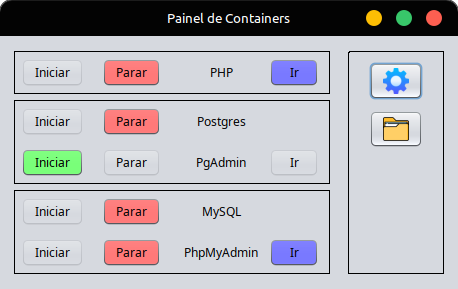
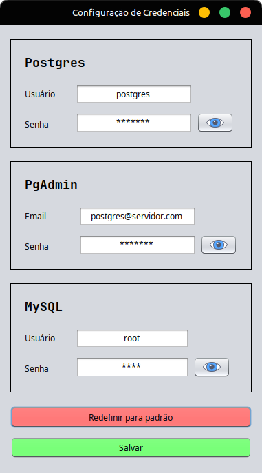

# LAMP Dashboard - Gerenciador de Containers

Este projeto é um **dashboard em Java (Swing)** que permite gerenciar facilmente os containers do repositório [lamp-compose](https://github.com/gustavogordoni/lamp-compose).

Com ele, você pode:

- Iniciar/Parar containers Docker
- Acompanhar o status dos serviços

---

## Principais telas

<details>
<summary>Screenshots</summary>
<br />
    <h3 align="center">Painel de Containers</h3>
    <div align="center"></div>
    <br />
    <h3 align="center">Config: Portas</h3>
    <div align="center"></div> 
    <br />
    <h3 align="center">Config: Volumes</h3>
    <div align="center"></div> 
    <br />
    <h3 align="center">Config: Credenciais</h3>
    <div align="center"></div> 
    <br />
</details>

---

## Tecnologias

- [Java 24.0.2](https://www.java.com/)
- [Netbeans 26](https://netbeans.apache.org/front/main/download/)
- [Docker](https://www.docker.com/) + [Docker Compose](https://docs.docker.com/compose/)

---

## Como usar

1. Clone este repositório
   
```
git clone https://github.com/gustavogordoni/lamp-dashboard.git
````

2. Certifique-se de clonar o repositório [`lamp-compose`](https://github.com/gustavogordoni/lamp-compose).
   
```
git clone https://github.com/gustavogordoni/lamp-compose.git
````

3. Crie o arquivo de variáveis de ambiente a partir do modelo:

```
cp lamp-compose/.env.example lamp-compose/.env
```

4. Copie a pasta dashboard do projeto para dentro de `lamp-compose`
```
cp -r lamp-dashboard/dashboard/ lamp-compose/
````

5. Acesse o diretório `lamp-compose`
```
cd lamp-compose
````

6. Rode o dashboard:

```
java -jar dashboard/lamp-dashboard.jar
```

7. Use a interface para gerenciar os serviços:

* **PHP + Apache**
* **MySQL**
* **phpMyAdmin**
* **PostgreSQL**
* **pgAdmin**

---

## Onde usar

Este dashboard foi criado para:

* **Facilitar o gerenciamento** de containers Docker
* Servir como **painel de controle rápido** em ambiente local
* Evitar comandos manuais de `docker compose up -d`, `docker down`, etc.
  
---

## Ideias futuras

Além das funcionalidades já implementadas, há planos para expandir o dashboard com recursos como:

- [x] ~~Gerenciamento de diretórios de **volumes** dos containers.~~
- [x] ~~Configuração e controle das **portas** dos serviços.~~
- [x] ~~Alteração de **credenciais**, incluindo senhas e nomes de usuários padrão.~~
- [ ] Melhorias na interface para uma **experiência mais intuitiva**.
